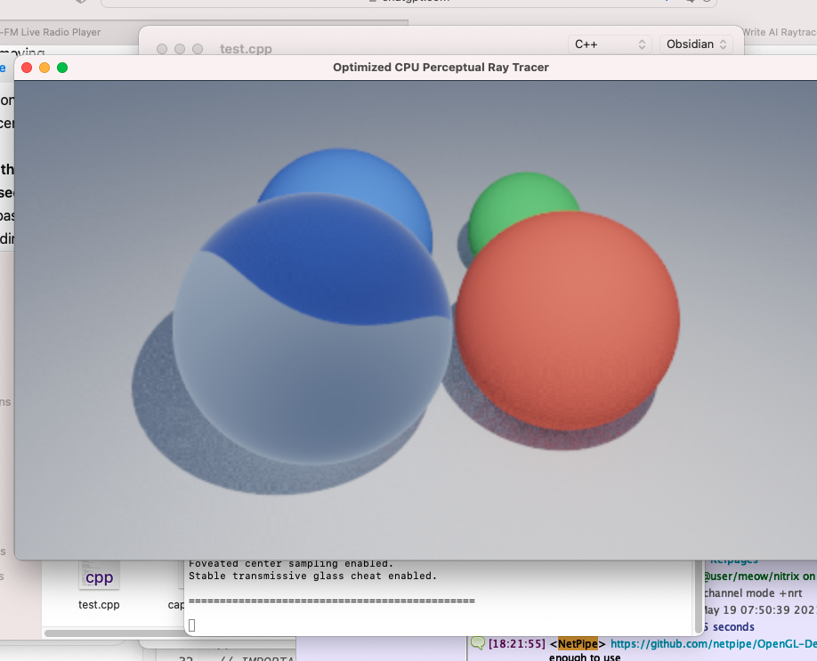

# OpenGL-Demos
OpenGL demo's repository

fastest realtime raytracer i've seen sofar for opengl! 
CPU only version 3 is running at 40% cpu in realtime 
Incredible the and latest GPU version only runs at 3% cpu on a macbook pro 
should run on a raspberry pi zero with mali no problems 

engilas renderer is MIT licence
the rest of the code is Unlicence
